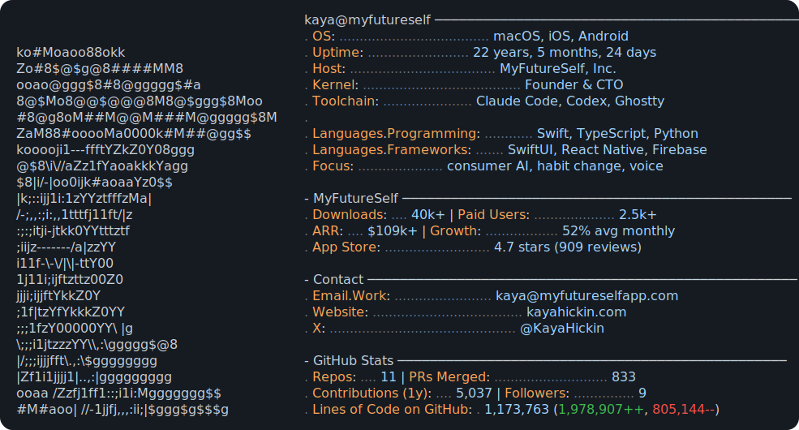

<picture>
  <source media="(prefers-color-scheme: dark)" srcset="dark_mode.svg">
  <source media="(prefers-color-scheme: light)" srcset="light_mode.svg">
  
</picture>

Technical founder building consumer AI products that change behavior. I build MyFutureSelf end to end across iOS, Android, backend, voice AI, analytics, paywalls, and internal tooling.

[Website](https://www.kayahickin.com) · [X](https://x.com/KayaHickin) · [MyFutureSelf](https://myfutureselfapp.com)

## Open Source

Most of my work lives in private repos, so I publish the useful pieces that make sense as standalone tools.

- [`ai-conversation-judge`](https://github.com/kayahickindev/ai-conversation-judge) - scripted AI chat evals with judge-model reports.
- [`app-store-review-digest`](https://github.com/kayahickindev/app-store-review-digest) - read-only App Store review summaries and response coverage.

Building in public around consumer AI, eval tooling, iOS products, and founder workflow tools.

The card refreshes daily from live <a href="https://www.kayahickin.com">personal-site metrics</a> and authenticated GitHub data. Terminal card inspired by <a href="https://github.com/Andrew6rant/Andrew6rant">Andrew6rant</a>.
